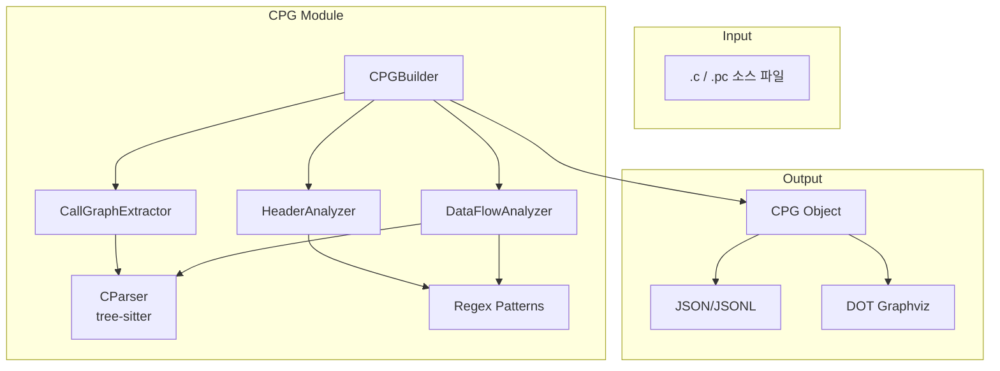

# CPG 모듈 기술 가이드

Pro*C/.c 파일에서 Code Property Graph를 추출하는 모듈의 알고리즘과 함수 역할을 설명합니다.

---

## 목차

1. [아키텍처 개요](#아키텍처-개요)
2. [모듈별 알고리즘](#모듈별-알고리즘)
3. [함수 레퍼런스](#함수-레퍼런스)
4. [사용 예시](#사용-예시)

---

## 아키텍처 개요



---

## 모듈별 알고리즘

### 1. CallGraphExtractor (call_graph.py)

함수 호출 관계를 추출하는 모듈입니다.

#### 알고리즘

```
1. Tree-sitter로 소스 코드 파싱
2. AST 순회하며 function_definition 노드에서 함수 정의 추출
3. call_expression 노드에서 함수 호출 추출
4. 현재 함수 컨텍스트 추적하여 caller → callee 매핑
5. 외부 함수(정의 없음)는 external=true로 마킹
```

#### 데이터 구조

```python
# 정방향 호출 맵
call_map: Dict[str, List[Tuple[callee, line, args]]]

# 역방향 호출 맵 (누가 이 함수를 호출하는지)
reverse_call_map: Dict[str, Set[str]]
```

---

### 2. HeaderAnalyzer (header_analyzer.py)

헤더 파일 의존성을 분석하는 모듈입니다.

#### 알고리즘

```
1. 정규식으로 #include 문 추출
   - 시스템 헤더: #include <header.h>
   - 로컬 헤더: #include "header.h"
2. EXEC SQL INCLUDE 문 추출
3. 파일 → 헤더 의존성 맵 구축
4. 헤더 → 파일 역방향 맵 구축 (공유 헤더 추적)
```

#### 정규식 패턴

```python
# 시스템 헤더
r'^\s*#\s*include\s*<([^>]+)>'

# 로컬 헤더
r'^\s*#\s*include\s*"([^"]+)"'

# SQL 헤더
r'EXEC\s+SQL\s+INCLUDE\s+(\w+)\s*;'
```

---

### 3. DataFlowAnalyzer (data_flow.py)

변수/구조체 데이터 흐름을 추적하는 모듈입니다.

#### 알고리즘

```
1. Tree-sitter로 변수/구조체 선언 추출
2. 정규식으로 할당문 분석
   - 좌변: 변수 쓰기(write)
   - 우변: 변수 읽기(read)
3. 구조체 필드 접근 패턴 분석
   - ptr->field (포인터)
   - obj.field (직접)
4. Pro*C 호스트 변수 추출
   - EXEC SQL BEGIN/END DECLARE SECTION 사이 변수
5. def-use 체인 구축
```

#### Def-Use 체인

```python
{
    "variable": "g_user_id",
    "definitions": [{"line": 153, "function": None}],
    "reads": [{"line": 573, "function": "initialize_database"}],
    "writes": [{"line": 320, "function": "main"}]
}
```

---

### 4. CPGBuilder (cpg_builder.py)

위 세 모듈을 통합하여 최종 CPG를 생성합니다.

#### 알고리즘

```
1. 파일/디렉토리에서 소스 코드 로드
2. CallGraphExtractor.extract() 호출 → 함수 노드 + 호출 엣지
3. HeaderAnalyzer.extract_includes() 호출 → 헤더 노드 + include 엣지
4. DataFlowAnalyzer.analyze() 호출 → 변수 노드 + 데이터흐름 엣지
5. 세 CPG를 merge()로 병합
6. JSON/DOT 형식으로 export
```

---

## 함수 레퍼런스

### CallGraphExtractor

| 함수 | 역할 |
|------|------|
| `extract(source_code, file_path)` | 소스에서 호출 그래프 추출, CPG 반환 |
| `get_callers(func_name)` | 해당 함수를 호출하는 함수 목록 |
| `get_callees(func_name)` | 해당 함수가 호출하는 함수 목록 |
| `get_call_chain(func_name, max_depth)` | 재귀적 호출 체인 트리 반환 |

---

### HeaderAnalyzer

| 함수 | 역할 |
|------|------|
| `extract_includes(source_code, file_path)` | include 문 추출, IncludeInfo 리스트 반환 |
| `build_dependency_cpg(files)` | 여러 파일의 의존성 그래프 CPG 구축 |
| `get_dependents(header_name)` | 해당 헤더를 사용하는 파일 목록 |
| `get_dependencies(file_path)` | 해당 파일이 포함하는 헤더 목록 |
| `get_common_headers(file_paths)` | 여러 파일의 공통 헤더 |
| `get_files_sharing_header(header_name)` | 같은 헤더를 공유하는 파일들 |

---

### DataFlowAnalyzer

| 함수 | 역할 |
|------|------|
| `analyze(source_code, file_path)` | 데이터 흐름 분석, CPG 반환 |
| `get_variable_uses(var_name)` | 변수의 모든 사용 위치 |
| `get_variable_definitions(var_name)` | 변수 정의 위치 |
| `get_variable_reads(var_name)` | 변수 읽기 위치 |
| `get_variable_writes(var_name)` | 변수 쓰기 위치 |
| `get_struct_field_accesses(struct_name)` | 구조체 필드 접근 목록 |
| `get_def_use_chains(var_name)` | def-use 체인 반환 |

---

### CPGBuilder

| 함수 | 역할 |
|------|------|
| `build_from_file(file_path)` | 단일 파일에서 CPG 생성 |
| `build_from_source(source_code, file_path)` | 소스 문자열에서 CPG 생성 |
| `build_from_directory(dir_path, recursive)` | 디렉토리 전체 CPG 생성 |
| `export_json(cpg, output_path)` | JSON 파일로 내보내기 |
| `export_jsonl(cpg, output_path)` | JSONL 파일로 내보내기 |
| `export_dot(cpg, output_path)` | Graphviz DOT 파일로 내보내기 |
| `get_file_dependencies(header_name)` | 헤더 사용 파일 조회 |
| `get_call_chain(func_name)` | 함수 호출 체인 조회 |
| `get_variable_flow(var_name)` | 변수 데이터 흐름 조회 |
| `summary(cpg)` | CPG 요약 정보 출력 |

---

### CPG 클래스 (models.py)

| 함수 | 역할 |
|------|------|
| `add_node(node)` | 노드 추가 |
| `add_edge(edge)` | 엣지 추가 |
| `get_node(node_id)` | ID로 노드 조회 |
| `get_nodes_by_type(node_type)` | 타입별 노드 조회 |
| `get_edges_by_type(edge_type)` | 타입별 엣지 조회 |
| `get_outgoing_edges(node_id)` | 나가는 엣지 조회 |
| `get_incoming_edges(node_id)` | 들어오는 엣지 조회 |
| `merge(other_cpg)` | 다른 CPG와 병합 |
| `to_dict()` | 딕셔너리로 변환 |
| `to_dot(title)` | DOT 문자열로 변환 |

---

## 사용 예시

### 기본 사용

```python
from CPG import CPGBuilder

# 단일 파일 분석
builder = CPGBuilder()
cpg = builder.build_from_file('sample.pc')

# 요약 출력
print(builder.summary(cpg))

# JSON 저장
builder.export_json(cpg, 'output.json')
```

### 디렉토리 전체 분석

```python
from CPG import CPGBuilder

builder = CPGBuilder()

# 하위 폴더 포함 전체 분석
cpg = builder.build_from_directory('d:/project/src', recursive=True)

# 현재 폴더만 분석
cpg = builder.build_from_directory('d:/project/src', recursive=False)

# 결과 확인
print(builder.summary(cpg))

# 지원 확장자: .c, .pc, .h, .cpp, .hpp
```

### 파일 간 공유 헤더 분석

```python
# stdio.h를 사용하는 모든 파일 조회
files = builder.get_file_dependencies('stdio.h')
print(f"stdio.h 사용 파일: {files}")

# 같은 헤더를 공유하는 파일들
shared = builder.header_analyzer.get_files_sharing_header('common.h')
print(f"common.h 공유 파일들: {shared}")

# 특정 파일의 헤더 목록
headers = builder.header_analyzer.get_dependencies('main.c')
```

### 함수 호출 분석

```python
# main 함수가 호출하는 함수들
callees = builder.call_graph_extractor.get_callees('main')

# initialize_database를 호출하는 함수들
callers = builder.call_graph_extractor.get_callers('initialize_database')

# 호출 체인 (5단계까지)
chain = builder.get_call_chain('main', max_depth=5)
```

### 헤더 의존성 분석

```python
# stdio.h를 사용하는 모든 파일
files = builder.get_file_dependencies('stdio.h')

# 특정 파일의 헤더 목록
headers = builder.header_analyzer.get_dependencies('sample.pc')
```

### 데이터 흐름 분석

```python
# 변수의 def-use 체인
flow = builder.get_variable_flow('g_user_id')
# {
#   "definitions": [...],
#   "reads": [...],
#   "writes": [...]
# }

# 구조체 필드 접근
accesses = builder.data_flow_analyzer.get_struct_field_accesses('host_user')
```

### Graphviz 시각화

```python
# DOT 파일 생성
builder.export_dot(cpg, 'graph.dot')

# 터미널에서 PNG로 변환
# dot -Tpng graph.dot -o graph.png
```
