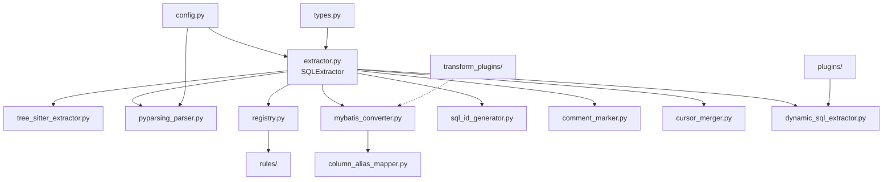

# sql_extractor 모듈

Pro*C/SQLC 코드에서 SQL 문을 추출하고 MyBatis 형식으로 변환하는 패키지입니다.

## 📁 디렉토리 구조

```
sql_extractor/
├── __init__.py                 # 패키지 진입점, 모든 public API export
├── types.py                    # 데이터 타입 정의 (SqlType, HostVariable, ExtractedSQL)
├── config.py                   # 설정 클래스 (SQLExtractorConfig)
├── extractor.py                # 메인 추출기 (SQLExtractor) ⭐
├── registry.py                 # 규칙 레지스트리 (SQLTypeRegistry, HostVariableRegistry)
├── tree_sitter_extractor.py    # Tree-sitter 기반 SQL 블록 추출
├── pyparsing_parser.py         # pyparsing 기반 SQL 파싱/변수 추출
├── mybatis_converter.py        # MyBatis XML 형식 변환
├── sql_id_generator.py         # SQL ID 생성 (select_0, insert_1 등)
├── comment_marker.py           # SQL 위치 주석 마킹
├── cursor_merger.py            # 커서 관련 SQL 병합
├── dynamic_sql_extractor.py    # 동적 SQL 재구성 (strcpy/sprintf 추적)
├── column_alias_mapper.py      # SELECT 컬럼 alias 추가
├── plugins/                    # SQL 관계 감지 플러그인
│   ├── base.py                 # SQLRelationshipPlugin 베이스 클래스
│   ├── cursor_relationship.py  # 커서 관계 감지
│   └── dynamic_sql_relationship.py  # 동적 SQL 관계 감지
├── rules/                      # SQL 타입/호스트 변수 규칙
│   ├── base.py                 # SQLTypeRule, HostVariableRule 베이스 클래스
│   ├── sql_type_rules.py       # 기본 SQL 타입 규칙
│   ├── host_variable_rules.py  # 호스트 변수 추출 규칙
│   └── db2_rules.py            # DB2 전용 규칙
└── transform_plugins/          # SQL 변환 플러그인
    ├── base.py                 # SQLTransformPlugin, TransformPipeline
    ├── pagination.py           # 페이지네이션 변환 (LIMIT/OFFSET)
    └── dialect.py              # DB 방언 변환 (Oracle→MySQL 등)
```

---

## 🎯 수정 목적별 가이드

### SQL 타입 인식 규칙 추가/수정

**수정 파일**: `rules/sql_type_rules.py`

```python
# 새 SQL 타입 추가 예시
class MyCustomRule(SQLTypeRule):
    name = "my_custom"
    priority = 50
    pattern = re.compile(r'EXEC\s+SQL\s+MY_CUSTOM', re.IGNORECASE)
```

등록 방법:
```python
from sql_extractor import SQLExtractor
extractor = SQLExtractor()
extractor.sql_type_registry.register(MyCustomRule())
```

---

### 호스트 변수 추출 로직 수정

**수정 파일**: `pyparsing_parser.py` 또는 `rules/host_variable_rules.py`

| 목적 | 파일 |
|------|------|
| 블랙리스트 키워드 추가 | `config.py` → `CUSTOM_HOST_VAR_BLACKLIST` |
| 새로운 변수 패턴 추가 | `rules/host_variable_rules.py` |
| 파싱 로직 수정 | `pyparsing_parser.py` → `extract_all_host_variables()` |

---

### MyBatis 변환 포맷 수정

**수정 파일**: `mybatis_converter.py`

| 목적 | 메서드/함수 |
|------|------------|
| 입력 변수 포맷 변경 (`:var` → `#{var}`) | `default_input_formatter()` 또는 커스텀 포맷터 |
| INTO 절 제거 로직 | `remove_into_clause()` |
| SQL 타입 → MyBatis 태그 매핑 | `determine_mybatis_type()` |

커스텀 포맷터 사용:
```python
from sql_extractor import MyBatisConverter

def my_formatter(var_name: str) -> str:
    return f"${{param.{var_name}}}"

converter = MyBatisConverter(input_formatter=my_formatter)
```

---

### 커서 병합 로직 수정

**수정 파일**: `cursor_merger.py`

| 목적 | 클래스/메서드 |
|------|-------------|
| DECLARE-OPEN-FETCH-CLOSE 그룹핑 | `CursorMerger.find_cursor_groups()` |
| 병합 SQL 생성 | `CursorMerger.merge()` |
| INTO 절 삽입 위치 | `_insert_into_clause()` |

---

### 동적 SQL (PREPARE/EXECUTE) 처리

**수정 파일**: `dynamic_sql_extractor.py`

| 목적 | 클래스/메서드 |
|------|-------------|
| C 문자열 함수 추가 | `DynamicSQLExtractor._string_functions` 집합 |
| sprintf 시뮬레이션 | `_simulate_sprintf()` |
| 변수 값 해석 | `_resolve_value()` |

---

### 컬럼 Alias 자동 추가

**수정 파일**: `column_alias_mapper.py`

| 목적 | 함수/메서드 |
|------|-----------|
| alias 변환 함수 변경 | `snake_to_camel()`, `keep_original()` 등 |
| sqlglot 기반 매핑 | `_add_aliases_with_sqlglot()` |
| 정규식 기반 매핑 (fallback) | `_add_aliases_with_regex()` |

---

### SQL ID 생성 규칙 수정

**수정 파일**: `sql_id_generator.py`

```python
# ID 형식 변경 (예: sql_select_0 → SQL_SELECT_001)
generator = SQLIdGenerator(prefix="SQL_", separator="_")
```

타입 매핑 수정: `generate_id()` 메서드의 `type_mapping` 딕셔너리

---

### 주석 마킹 포맷 수정

**수정 파일**: `comment_marker.py`

제공되는 포맷터:
- `default_comment_formatter`: `/* sql extracted: select_0 */`
- `detailed_comment_formatter`: `/* sql extracted: select_0 | type: select | func: main | line: 42 */`
- `mybatis_ref_comment_formatter`: `/* @mybatis:select_0 (select) */`
- `c_style_marker_formatter`: `// SQL_MARKER: select_0`

커스텀 포맷터:
```python
from sql_extractor import SQLCommentMarker

marker = SQLCommentMarker(
    format_template="/* MyBatis: {sql_id} - {sql_type} */"
)
```

---

### SQL 변환 플러그인 추가 (페이지네이션, 방언 변환 등)

**수정 파일**: `transform_plugins/` 디렉토리

새 플러그인 생성:
```python
from sql_extractor.transform_plugins import SQLTransformPlugin

class MyTransformPlugin(SQLTransformPlugin):
    name = "my_transform"
    priority = 50
    
    def can_transform(self, sql, sql_type, metadata):
        return sql_type == "select"
    
    def transform(self, sql, sql_type, metadata):
        return sql.replace("OLD_TABLE", "NEW_TABLE")
```

파이프라인 등록:
```python
from sql_extractor import TransformPipeline

pipeline = TransformPipeline()
pipeline.register(MyTransformPlugin())
result = pipeline.transform(sql, "select")
```

---

### 관계 감지 플러그인 추가

**수정 파일**: `plugins/` 디렉토리

기존 플러그인:
- `CursorRelationshipPlugin`: DECLARE CURSOR → OPEN → FETCH → CLOSE 관계
- `DynamicSQLRelationshipPlugin`: PREPARE → EXECUTE → DEALLOCATE 관계

새 플러그인 생성:
```python
from sql_extractor.plugins import SQLRelationshipPlugin

class MyRelationshipPlugin(SQLRelationshipPlugin):
    def can_handle(self, sql_elements):
        return any(el.get('sql_type') == 'MY_TYPE' for el in sql_elements)
    
    def extract_relationships(self, sql_elements, all_elements=None):
        # 관계 추출 로직
        return [{'relationship_id': '...', 'relationship_type': 'MY_RELATION', ...}]
```

---

### DB2 전용 규칙 추가

**수정 파일**: `rules/db2_rules.py`

DB2 모드 활성화:
```python
config = SQLExtractorConfig(DBMS_DIALECT="db2")
extractor = SQLExtractor(config=config)
extractor.sql_type_registry.load_db2_rules()
```

---

## 📊 모듈 의존성 다이어그램



---

## 🔧 핵심 클래스 요약

| 클래스 | 파일 | 역할 |
|--------|------|------|
| `SQLExtractor` | `extractor.py` | 메인 진입점. SQL 추출/분해/변환 통합 |
| `SQLExtractorConfig` | `config.py` | 추출 동작 설정 (인코딩, 블랙리스트, 방언 등) |
| `TreeSitterSQLExtractor` | `tree_sitter_extractor.py` | EXEC SQL 블록 위치 추출 |
| `PyparsingProCParser` | `pyparsing_parser.py` | SQL 타입 결정, 호스트 변수 파싱 |
| `SQLTypeRegistry` | `registry.py` | SQL 타입 규칙 관리 |
| `HostVariableRegistry` | `registry.py` | 호스트 변수 규칙 관리 |
| `MyBatisConverter` | `mybatis_converter.py` | Pro*C SQL → MyBatis XML 변환 |
| `CursorMerger` | `cursor_merger.py` | 커서 관련 SQL 병합 |
| `DynamicSQLExtractor` | `dynamic_sql_extractor.py` | C 문자열 함수로 조합된 SQL 재구성 |
| `ColumnAliasMapper` | `column_alias_mapper.py` | SELECT 컬럼에 AS alias 추가 |
| `TransformPipeline` | `transform_plugins/base.py` | SQL 변환 플러그인 파이프라인 |

---

## 📝 관련 문서

- [USAGE.md](./USAGE.md) - 상세 사용법 및 예제
- [INTEGRATION_GUIDE.md](./INTEGRATION_GUIDE.md) - 통합 가이드
